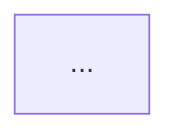

以下是一家红筹企业的穿透路径数据和 UBO 识别结果。请完成两件事：
1. 审查路径合理性，指出可能错误或缺失的环节
2. 生成中文分析报告（含 Mermaid 架构图）

写作要求：
- 报告面向银行业对公/合规人员，结论先行，避免空话。
- 风险提示要具体（如 VIE 合规性、离岸层不透明、股权质押、穿透断点），不要泛泛而谈。
- Mermaid 图中节点名不要用括号和引号，避免语法解析失败；股权边用实线 -->，VIE 协议控制用虚线 -.->。

穿透数据：
{penetration_json}

LLM-A提取结果：
{llm_a_json}

输出格式（Markdown，严格按以下分节）：
## 路径审查
- 合理性：是/否
- 问题：...
- 建议：...

## 分析报告
（企业概况 / 穿透链条 / UBO结果 / 架构特点 / 风险提示）

## Mermaid架构图

